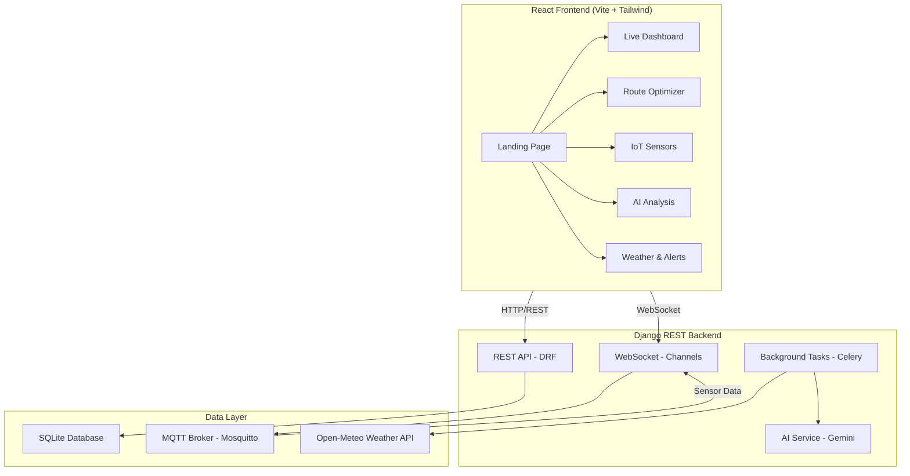

# FloodVision — Full-Stack Implementation Plan

A complete flood monitoring and prediction platform connecting a React glassmorphism frontend to a Django REST backend with SQLite, AI analysis via Gemini, IoT sensor data, weather APIs, and smart route optimization.

---

## User Review Required

> [!IMPORTANT]
> **Google Maps API Key**: The `@react-google-maps/api` package and the backend `googlemaps` library both require a **paid** Google Maps Platform API key with Maps JavaScript API, Directions API, and Street View Static API enabled. There is no free alternative for interactive Google Maps. **Do you already have a Google Maps API key, or should we use the free [Leaflet + OpenStreetMap](https://leafletjs.com/) alternative instead?**

> [!IMPORTANT]
> **Gemini API Key**: The AI flood prediction feature uses Google's Gemini Vision model to analyze street images. You need a **Gemini API key** (free tier available from [Google AI Studio](https://aistudio.google.com/)). The `.env.example` already has a placeholder for `GEMINI_API_KEY`.

> [!WARNING]
> **ESP32 MQTT Broker**: The IoT water level monitoring feature requires a running MQTT broker (Mosquitto). For local development, we'll simulate sensor data. Actual ESP32 hardware integration will need the physical device connected to your network.

> [!IMPORTANT]
> **Free-only APIs**: Per your request, we will use only **free** services:
> - **Open-Meteo API** (no key needed) for weather/rainfall data
> - **Gemini API** (free tier: 60 requests/min) for AI image analysis
> - **OpenStreetMap + Leaflet** (free) OR Google Maps (needs key) for mapping
> - **Mosquitto** (free, open-source) for MQTT broker
> - **SQLite** (built-in) for database

## Open Questions

> [!IMPORTANT]
> 1. **Google Maps vs Leaflet**: Google Maps requires a billing-enabled API key. Should we use **Leaflet + OpenStreetMap** (completely free) or do you have a Google Maps API key ready?
> 2. **GSAP**: You mentioned GSAP for 3D animations. GSAP requires a paid license for some features. Should we use **Framer Motion** (already in package.json as `motion`) which is fully free, or install GSAP's free tier?
> 3. **Street View Images**: For the AI analysis demo, should we use sample/stock images of streets, or do you want to integrate with Google Street View Static API (requires paid key)?
> 4. **ESP32 Hardware**: Do you have the actual ESP32 + HC-SR04 hardware ready, or should we build the IoT dashboard with simulated data first and add real MQTT later?

---

## Architecture Overview



---

## Proposed Changes

### Component 1: Django Backend — Core Setup & Models

Create a new Django app `floodapi` with all models, serializers, views, and URL routing.

---

#### [NEW] [requirements.txt](file:///c:/Users/User/Desktop/learning/Flood%20Vision/floodv_ision_backend/requirements.txt)

All Python dependencies with setup instructions as comments:

```
# FloodVision Backend Requirements
# =================================
# 1. Create a virtual environment: python -m venv venv
# 2. Activate: venv\Scripts\activate (Windows)
# 3. Install: pip install -r requirements.txt
# 4. Create .env file from .env.example
# 5. Run migrations: python manage.py migrate
# 6. Start server: python manage.py runserver

django>=5.2
djangorestframework>=3.15
django-cors-headers>=4.4
django-environ>=0.12
channels>=4.1
channels-redis>=4.2  # Optional: Use in-memory channel layer for dev
daphne>=4.1
celery>=5.4
Pillow>=11.0
google-generativeai>=0.8
googlemaps>=4.10  # Only if using Google Maps
paho-mqtt>=2.1
requests>=2.32
httpx>=0.28

# NOTES FOR API KEYS:
# ===================
# 1. GEMINI_API_KEY: Get free from https://aistudio.google.com/apikey
# 2. GOOGLE_MAPS_API_KEY: Get from https://console.cloud.google.com
#    (Optional - we use Leaflet/OpenStreetMap as free alternative)
# 3. Open-Meteo: NO API key needed (completely free)
# 4. MQTT Broker: Install Mosquitto from https://mosquitto.org/download/
#    (Free, open-source. Run: mosquitto -v)
```

---

#### [NEW] [floodapi/__init__.py](file:///c:/Users/User/Desktop/learning/Flood%20Vision/floodv_ision_backend/floodapi/__init__.py)
#### [NEW] [floodapi/apps.py](file:///c:/Users/User/Desktop/learning/Flood%20Vision/floodv_ision_backend/floodapi/apps.py)

New Django app registration.

#### [NEW] [floodapi/models.py](file:///c:/Users/User/Desktop/learning/Flood%20Vision/floodv_ision_backend/floodapi/models.py)

Database models (SQLite):

| Model | Purpose | Key Fields |
|-------|---------|------------|
| `FloodZone` | Stores analyzed locations with flood risk | `lat`, `lng`, `risk_level` (0-100), `risk_category` (green/yellow/red), `address`, `analysis_data` (JSON), `last_analyzed` |
| `SensorNode` | IoT ESP32 sensor registration | `node_id`, `name`, `location`, `lat`, `lng`, `is_active`, `last_seen` |
| `SensorReading` | Time-series water level data | `sensor` (FK), `water_level_cm`, `temperature`, `rssi`, `timestamp` |
| `WeatherData` | Cached weather/rainfall data | `lat`, `lng`, `temperature`, `humidity`, `rainfall_mm`, `wind_speed`, `condition`, `forecast_json`, `fetched_at` |
| `FloodAlert` | Generated flood warnings | `zone` (FK), `severity` (critical/warning/info), `message`, `is_active`, `created_at` |
| `RouteQuery` | Saved route optimization results | `start_lat`, `start_lng`, `end_lat`, `end_lng`, `optimization_param`, `route_data` (JSON), `risk_score`, `created_at` |
| `AIAnalysis` | Street image analysis results | `image_url`, `lat`, `lng`, `risk_percentage`, `road_condition`, `drain_status`, `pothole_count`, `analysis_text`, `raw_response`, `created_at` |

#### [NEW] [floodapi/serializers.py](file:///c:/Users/User/Desktop/learning/Flood%20Vision/floodv_ision_backend/floodapi/serializers.py)

DRF serializers for all models.

#### [NEW] [floodapi/views.py](file:///c:/Users/User/Desktop/learning/Flood%20Vision/floodv_ision_backend/floodapi/views.py)

REST API endpoints:

| Endpoint | Method | Purpose |
|----------|--------|---------|
| `/api/flood-zones/` | GET | List all flood zones with risk data |
| `/api/flood-zones/analyze/` | POST | Trigger AI analysis on coordinates |
| `/api/sensors/` | GET | List all IoT sensor nodes |
| `/api/sensors/<id>/readings/` | GET | Get sensor reading history |
| `/api/sensors/latest/` | GET | Get latest readings from all sensors |
| `/api/weather/current/` | GET | Get current weather for coordinates |
| `/api/weather/forecast/` | GET | Get 7-day forecast |
| `/api/alerts/` | GET | List active flood alerts |
| `/api/alerts/<id>/dismiss/` | POST | Dismiss an alert |
| `/api/route/optimize/` | POST | Calculate flood-safe route |
| `/api/ai/analyze-image/` | POST | Analyze uploaded street image |
| `/api/ai/analyze-coordinates/` | POST | Analyze street view at coordinates |
| `/api/dashboard/stats/` | GET | Aggregated dashboard statistics |

#### [NEW] [floodapi/services/ai_service.py](file:///c:/Users/User/Desktop/learning/Flood%20Vision/floodv_ision_backend/floodapi/services/ai_service.py)

Gemini Vision integration service:
- Takes a street image (uploaded or from URL) 
- Sends to Gemini with a structured prompt to analyze: road condition, drain visibility, potholes, low-lying areas, vegetation (water absorption), slope
- Returns structured JSON with risk percentage and breakdown

#### [NEW] [floodapi/services/weather_service.py](file:///c:/Users/User/Desktop/learning/Flood%20Vision/floodv_ision_backend/floodapi/services/weather_service.py)

Open-Meteo integration (completely free, no API key):
- Fetches current weather, hourly/daily rainfall
- Caches data in `WeatherData` model (15-min cache)
- Computes flood risk multiplier based on rainfall intensity

#### [NEW] [floodapi/services/route_service.py](file:///c:/Users/User/Desktop/learning/Flood%20Vision/floodv_ision_backend/floodapi/services/route_service.py)

Route optimization engine:
- Uses OSRM (free, open-source routing) or basic A* pathfinding
- Cross-references route segments with `FloodZone` risk data
- Calculates risk-weighted paths vs shortest paths
- Returns route polyline, estimated time, max flood exposure

#### [NEW] [floodapi/services/mqtt_service.py](file:///c:/Users/User/Desktop/learning/Flood%20Vision/floodv_ision_backend/floodapi/services/mqtt_service.py)

MQTT client for receiving ESP32 sensor data:
- Subscribes to `floodvision/sensors/+/data` topic
- Parses incoming JSON payloads
- Stores readings in `SensorReading` model
- Triggers alerts when thresholds exceeded

#### [NEW] [floodapi/consumers.py](file:///c:/Users/User/Desktop/learning/Flood%20Vision/floodv_ision_backend/floodapi/consumers.py)

Django Channels WebSocket consumer:
- `SensorConsumer`: Pushes real-time sensor data to connected dashboards
- `AlertConsumer`: Pushes new flood alerts to all connected clients

#### [NEW] [floodapi/routing.py](file:///c:/Users/User/Desktop/learning/Flood%20Vision/floodv_ision_backend/floodapi/routing.py)

WebSocket URL routing for Channels.

#### [MODIFY] [settings.py](file:///c:/Users/User/Desktop/learning/Flood%20Vision/floodv_ision_backend/floodv_ision_backend/settings.py)

- Add `rest_framework`, `corsheaders`, `channels`, `floodapi` to `INSTALLED_APPS`
- Configure CORS to allow React frontend (port 3000)
- Add `CHANNEL_LAYERS` config (in-memory for dev)
- Add `django-environ` for `.env` loading
- Configure `ASGI_APPLICATION`

#### [MODIFY] [urls.py](file:///c:/Users/User/Desktop/learning/Flood%20Vision/floodv_ision_backend/floodv_ision_backend/urls.py)

- Include `floodapi.urls` with `/api/` prefix

#### [NEW] [.env.example](file:///c:/Users/User/Desktop/learning/Flood%20Vision/floodv_ision_backend/.env.example)

Environment variable template with setup instructions.

#### [MODIFY] [asgi.py](file:///c:/Users/User/Desktop/learning/Flood%20Vision/floodv_ision_backend/floodv_ision_backend/asgi.py)

Configure ASGI with Channels for WebSocket support.

---

### Component 2: React Frontend — Backend Integration & API Layer

Connect the existing frontend components to the Django backend.

---

#### [NEW] [src/api/client.ts](file:///c:/Users/User/Desktop/learning/Flood%20Vision/Flood%20vision%20frontend/src/api/client.ts)

Axios-based API client:
- Base URL configuration (defaults to `http://localhost:8000/api`)
- Request/response interceptors
- Error handling

#### [NEW] [src/api/endpoints.ts](file:///c:/Users/User/Desktop/learning/Flood%20Vision/Flood%20vision%20frontend/src/api/endpoints.ts)

Typed API functions for each backend endpoint:
- `fetchFloodZones()`, `analyzeLocation(lat, lng)`
- `fetchSensors()`, `fetchSensorReadings(id)`
- `fetchWeather(lat, lng)`, `fetchForecast(lat, lng)`
- `fetchAlerts()`, `dismissAlert(id)`
- `optimizeRoute(start, end, param)`
- `analyzeImage(file)`, `analyzeCoordinates(lat, lng)`

#### [NEW] [src/hooks/useWebSocket.ts](file:///c:/Users/User/Desktop/learning/Flood%20Vision/Flood%20vision%20frontend/src/hooks/useWebSocket.ts)

WebSocket hook for real-time sensor data and alerts.

#### [MODIFY] [src/store.ts](file:///c:/Users/User/Desktop/learning/Flood%20Vision/Flood%20vision%20frontend/src/store.ts)

- Add async actions that call backend APIs
- Keep simulated data as fallback when backend is offline
- Add `isBackendConnected` state
- Add `weatherData`, `forecastData` state
- Add actions: `fetchFloodZonesFromAPI()`, `submitAIAnalysis()`, `fetchWeatherFromAPI()`, etc.

---

### Component 3: Frontend — Dark/Light Theme Fix & Glassmorphism Polish

Fix the theme system to properly handle both modes with correct colors.

---

#### [MODIFY] [src/index.css](file:///c:/Users/User/Desktop/learning/Flood%20Vision/Flood%20vision%20frontend/src/index.css)

- Add `:root` variables for light theme (currently only dark theme variables exist)
- Add `.light` class overrides for ALL CSS custom properties
- Fix glassmorphism colors for light mode (currently too transparent)
- Add liquid glass shimmer animation for light mode
- Add smooth theme transition animation
- Fix text contrast issues in light mode

#### [MODIFY] All component files

- Replace hardcoded dark colors (`text-white`, `bg-[#141313]`, etc.) with CSS variable-based classes
- Use `dark:` and `light:` Tailwind variants where needed
- Ensure all glass panels, cards, buttons use theme-aware colors
- Fix readability of colored indicators (🟢🟡🔴) in both themes

---

### Component 4: Frontend — Interactive Flood Map with Leaflet

Replace the simulated map with a real interactive map.

---

#### [NEW] [src/components/FloodMap.tsx](file:///c:/Users/User/Desktop/learning/Flood%20Vision/Flood%20vision%20frontend/src/components/FloodMap.tsx)

Interactive Leaflet map component:
- OpenStreetMap tile layer (free, no API key)
- Color-coded flood zone overlay circles (green/yellow/red)
- Sensor node markers with popups showing live data
- Route polyline visualization
- Click-to-analyze: click any point to trigger AI flood analysis
- Heatmap layer for risk visualization

#### Package additions needed:
- `leaflet` + `@types/leaflet`
- `react-leaflet`

---

### Component 5: Frontend — AI Street Analysis View

Enhance the AI analysis with real Gemini integration.

---

#### [NEW] [src/components/AIAnalysisView.tsx](file:///c:/Users/User/Desktop/learning/Flood%20Vision/Flood%20vision%20frontend/src/components/AIAnalysisView.tsx)

Full AI analysis page:
- Image upload zone (drag & drop)
- Coordinate input for street-level analysis
- Results display: risk percentage gauge, breakdown chart, recommendations
- History of past analyses from database
- Integration with Gemini via backend API

---

### Component 6: Frontend — Weather Dashboard

Real weather data integration.

---

#### [NEW] [src/components/WeatherView.tsx](file:///c:/Users/User/Desktop/learning/Flood%20Vision/Flood%20vision%20frontend/src/components/WeatherView.tsx)

Weather and flood prediction panel:
- Current conditions card (temp, humidity, wind, rainfall)
- Hourly rainfall chart (Recharts - already installed)
- 7-day forecast cards
- Flood risk prediction based on accumulated rainfall
- Early warning indicators

---

### Component 7: Frontend — Emergency Alert System

---

#### [NEW] [src/components/AlertCenter.tsx](file:///c:/Users/User/Desktop/learning/Flood%20Vision/Flood%20vision%20frontend/src/components/AlertCenter.tsx)

Emergency alert management:
- Real-time alert feed via WebSocket
- Severity-based color coding and sound notifications
- Alert dismissal with reason logging
- Alert history timeline
- Notification permission request for browser push notifications

---

### Component 8: Update Existing Views

#### [MODIFY] [DashboardView.tsx](file:///c:/Users/User/Desktop/learning/Flood%20Vision/Flood%20vision%20frontend/src/components/DashboardView.tsx)

- Integrate FloodMap component (replace simulated map)
- Connect to backend for real sensor data
- Add weather panel integration
- Fix dark/light theme colors

#### [MODIFY] [RouteSimView.tsx](file:///c:/Users/User/Desktop/learning/Flood%20Vision/Flood%20vision%20frontend/src/components/RouteSimView.tsx)

- Connect route calculation to backend API
- Display routes on actual Leaflet map
- Show risk comparison between routes
- Fix theme colors

#### [MODIFY] [SensorsView.tsx](file:///c:/Users/User/Desktop/learning/Flood%20Vision/Flood%20vision%20frontend/src/components/SensorsView.tsx)

- Connect to backend WebSocket for live data
- Add sensor reading history charts
- Fix theme colors

#### [MODIFY] [LandingView.tsx](file:///c:/Users/User/Desktop/learning/Flood%20Vision/Flood%20vision%20frontend/src/components/LandingView.tsx)

- Add GSAP/Framer Motion entry animations
- Fix theme colors and glass effects

#### [MODIFY] [Header.tsx](file:///c:/Users/User/Desktop/learning/Flood%20Vision/Flood%20vision%20frontend/src/components/Header.tsx) & [Sidebar.tsx](file:///c:/Users/User/Desktop/learning/Flood%20Vision/Flood%20vision%20frontend/src/components/Sidebar.tsx)

- Add new navigation items (AI Analysis, Weather, Alerts)
- Fix theme toggle colors

#### [MODIFY] [App.tsx](file:///c:/Users/User/Desktop/learning/Flood%20Vision/Flood%20vision%20frontend/src/App.tsx)

- Add routes for new views (AI Analysis, Weather, Alerts)
- Add WebSocket connection lifecycle

---

### Component 9: Frontend Package Updates

#### [MODIFY] [package.json](file:///c:/Users/User/Desktop/learning/Flood%20Vision/Flood%20vision%20frontend/package.json)

New dependencies to install:
```json
{
  "dependencies": {
    "axios": "^1.7.0",
    "leaflet": "^1.9.4",
    "react-leaflet": "^4.2.1",
    "gsap": "^3.12.5",
    "@types/leaflet": "^1.9.8"
  }
}
```

---

### Component 10: Environment & Configuration

#### [NEW] [.env](file:///c:/Users/User/Desktop/learning/Flood%20Vision/floodv_ision_backend/.env.example)

```env
# Django
SECRET_KEY=your-secret-key-here
DEBUG=True

# AI
GEMINI_API_KEY=your-gemini-api-key

# Maps (Optional - only if using Google Maps)
GOOGLE_MAPS_API_KEY=your-google-maps-key

# MQTT (Optional - for ESP32 integration)
MQTT_BROKER_HOST=localhost
MQTT_BROKER_PORT=1883
```

#### [NEW] [.env](file:///c:/Users/User/Desktop/learning/Flood%20Vision/Flood%20vision%20frontend/.env)

```env
VITE_API_BASE_URL=http://localhost:8000/api
VITE_WS_BASE_URL=ws://localhost:8000/ws
VITE_GEMINI_API_KEY=your-gemini-api-key
```

---

## Downloads & Setup Instructions

### AI Models (No Download Needed)
- **Gemini**: Cloud API — no local model download required. Get free API key from [Google AI Studio](https://aistudio.google.com/apikey)
- The AI analysis works by sending images to the Gemini Vision API which returns structured flood risk analysis

### Software to Install
| Software | URL | Purpose |
|----------|-----|---------|
| Python 3.11+ | [python.org](https://python.org) | Django backend |
| Node.js 18+ | [nodejs.org](https://nodejs.org) | React frontend |
| Mosquitto MQTT | [mosquitto.org/download](https://mosquitto.org/download/) | IoT sensor broker (optional for dev) |

### ESP32 Firmware (If you have hardware)
The ESP32 sketch will be provided as [esp32_firmware/flood_sensor.ino](file:///c:/Users/User/Desktop/learning/Flood%20Vision/esp32_firmware/flood_sensor.ino) — Arduino IDE compatible.

---

## Verification Plan

### Automated Tests

1. **Backend API Tests**:
   ```bash
   cd floodv_ision_backend
   python manage.py test floodapi
   ```

2. **Frontend Build Check**:
   ```bash
   cd "Flood vision frontend"
   npm run lint
   npm run build
   ```

3. **Integration Test**:
   - Start backend: `python manage.py runserver`
   - Start frontend: `npm run dev`
   - Verify API calls succeed in browser dev tools

### Manual Verification

1. **Theme Toggle**: Switch between dark/light mode and verify all components look correct
2. **AI Analysis**: Upload a street image and verify Gemini returns flood risk analysis
3. **Weather Data**: Confirm real weather data loads from Open-Meteo
4. **Map**: Verify flood zones display on the Leaflet map with correct colors
5. **Route Optimizer**: Calculate a route and verify risk-based vs shortest path comparison
6. **Sensor Dashboard**: Verify simulated sensor data updates in real-time
7. **Alerts**: Verify flood alerts appear and can be dismissed

---

## Execution Order

| Phase | Components | Estimated Files |
|-------|-----------|----------------|
| 1 | Backend core (models, settings, migrations) | ~12 files |
| 2 | Backend API (views, serializers, URLs) | ~8 files |
| 3 | Backend services (AI, weather, routing, MQTT) | ~5 files |
| 4 | Frontend API layer + store updates | ~5 files |
| 5 | Theme fix (CSS + all components) | ~10 files |
| 6 | New views (FloodMap, AI, Weather, Alerts) | ~4 files |
| 7 | Existing view updates + integration | ~7 files |
| 8 | Polish, testing, ESP32 firmware | ~5 files |
| **Total** | | **~56 files** |
